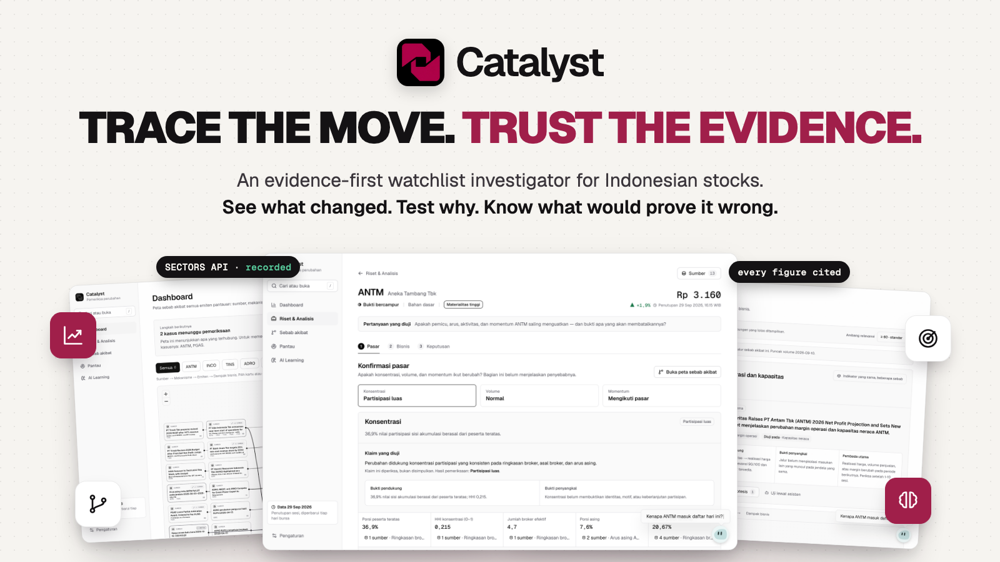
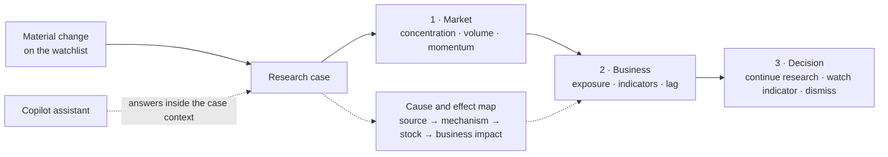
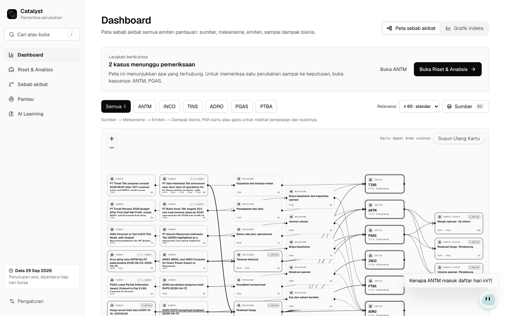
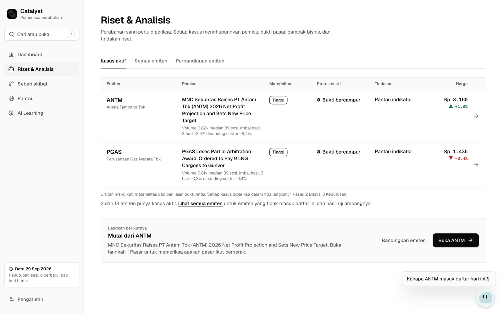
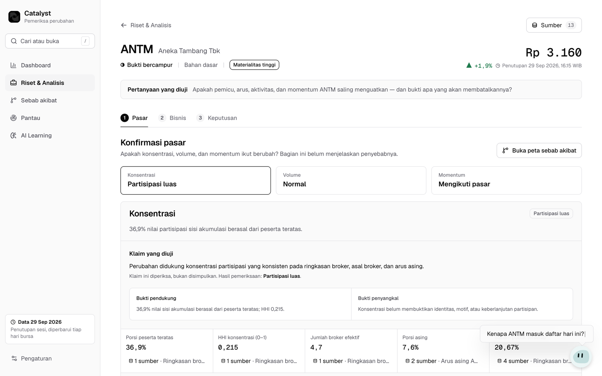
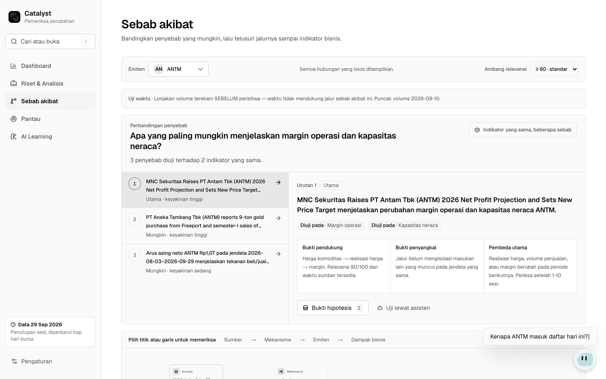
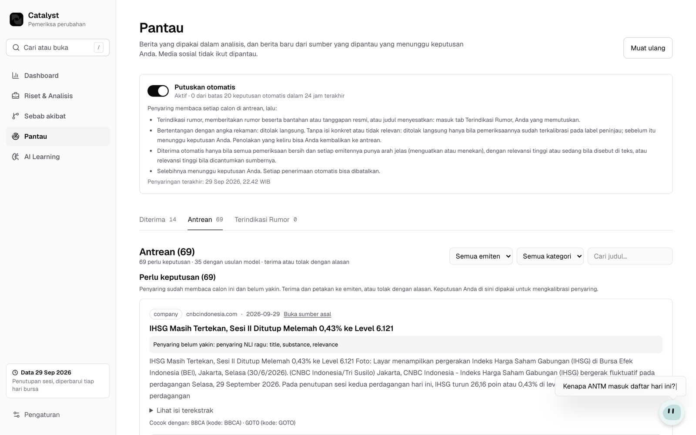
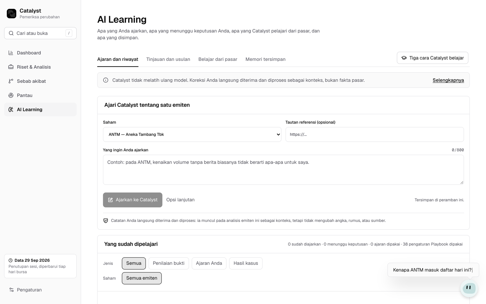
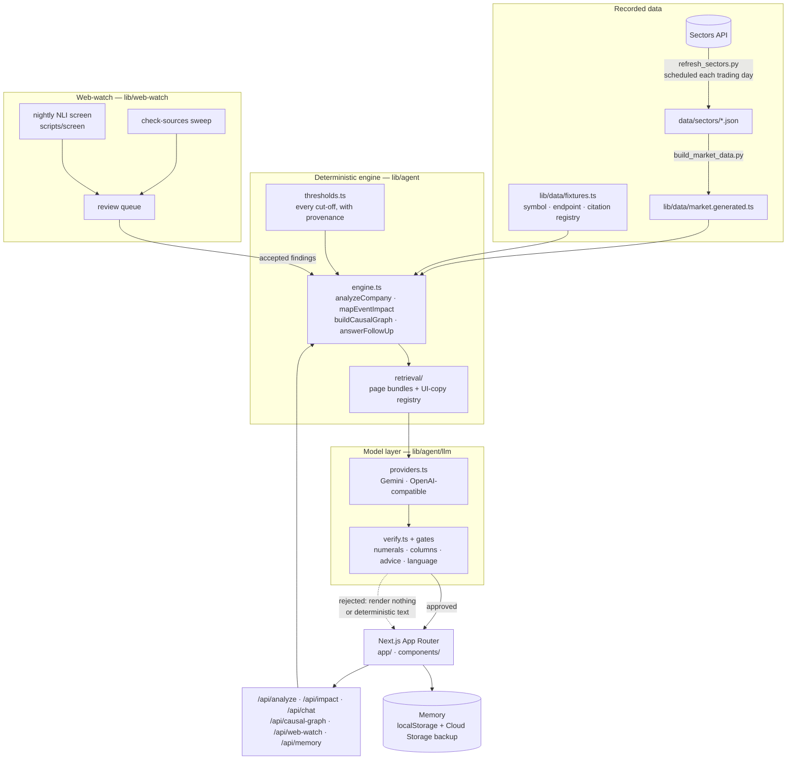

<p align="center">
  
</p>

<h1 align="center">Catalyst</h1>

<p align="center">
  <b>An evidence-first watchlist investigator for stocks on the Indonesia Stock Exchange (IDX).</b><br>
  See what changed. Test which explanation holds. Know what would prove it wrong.
</p>

<p align="center">
  <a href="https://catalyst-web-ibyebnreqa-uc.a.run.app"><b>Live app</b></a> ·
  <a href="#quick-start">Quick start</a> ·
  <a href="#how-a-case-is-investigated">How it works</a> ·
  <a href="#screens">Screens</a> ·
  <a href="#architecture">Architecture</a> ·
  <a href="#trust-guarantees">Trust guarantees</a> ·
  <a href="docs/DEPLOY.md">Deploy guide</a>
</p>

<p align="center">
  
  
  
  
  
</p>

| | |
|---|---|
| **Live app** | https://catalyst-web-ibyebnreqa-uc.a.run.app |
| **Built for** | Sectors Hackathon 2026 — Track 01 |
| **Data** | [Sectors API](https://sectors.app) recordings, refreshed every trading day |
| **Interface language** | Bahasa Indonesia (the assistant also answers in English) |
| **Runs on** | Google Cloud Run, Cloud Build, Cloud Scheduler, Cloud Storage |

## Contents

- [Overview](#overview)
- [Why Catalyst](#why-catalyst)
- [How a case is investigated](#how-a-case-is-investigated)
- [Screens](#screens)
- [Quick start](#quick-start)
- [Configuration](#configuration)
- [Architecture](#architecture)
- [Data provenance](#data-provenance)
- [Trust guarantees](#trust-guarantees)
- [Verification](#verification)
- [Deployment and operations](#deployment-and-operations)
- [Project layout](#project-layout)
- [Documentation](#documentation)
- [Contributors](#contributors)

## Overview

Catalyst is built for the discretionary, event-driven investor who follows 10–30 IDX stocks and,
after every material move, asks the same four questions:

1. **What changed?** — price, volume, foreign flow, broker concentration, a filing, a headline.
2. **Which explanation is strongest?** — several causes compete; Catalyst compares them against
   the same business indicators instead of picking the first plausible story.
3. **What business impact should show up?** — margin, volume, price realisation, balance sheet.
4. **What evidence would prove it wrong?** — every causal path carries its own falsifier and a
   lag after which to check it.

Every figure on screen is computed from recorded [Sectors API](https://sectors.app) responses and
carries its source: the endpoint, the field, and the window it covers. A language model writes the
sentences that interpret those figures, and every sentence passes a verifier before it ships. When
a draft cannot be supported by the material, Catalyst shows nothing rather than guessing.

Catalyst is a research tool. It never tells anyone to buy or sell, and it never executes a trade.

## Why Catalyst

**The problem.** When a stock on the watchlist moves, the evidence is scattered across broker
summaries, foreign-flow tables, quarterly financials, company filings, commodity prices and the
news. Most tools answer "why did it move?" with one confident sentence. That sentence is rarely
tested against the market data and never states what would disprove it.

**What Catalyst does differently.**

- **Causes compete.** A move is framed as a question under test. Alternative explanations sit side
  by side and are ranked by the same indicators, with a timing check that flags a volume spike
  recorded *before* the event that supposedly caused it.
- **Claims are checked, not concluded.** Each pillar (concentration, volume, momentum) states the
  claim under test, the supporting evidence, the contradicting evidence, and the verdict.
- **Every number is traceable.** Click a figure and see the recording it came from. Source counts
  are per figure, never per card.
- **The investor stays in charge.** Reader corrections are stored as open hypotheses, not as facts.
  Lessons become proposed rules that apply only after the reader approves them.

## How a case is investigated



1. **Dashboard** maps every watched stock as a causal graph: *source → mechanism → stock →
   business impact*, filtered by the reader's relevance threshold.
2. **Riset & Analisis** lists the stocks with an active case, ordered by materiality and evidence
   state, and lets the reader compare stocks side by side.
3. A **case** walks three steps — *Pasar* (market), *Bisnis* (business), *Keputusan* (decision) —
   and ends in exactly one research action.
4. **Sebab akibat** (cause and effect) compares competing causes against the same indicators and
   traces each path down to a business metric, with its supporting evidence, contradicting
   evidence and key differentiator.
5. **Pantau** (watch) screens new articles from verified sources. A rule-based sweep and a nightly
   NLI screen accept, reject, or flag rumours; anything uncertain waits for the reader's decision,
   and every automatic decision can be reversed.
6. **AI Learning** shows what the reader taught Catalyst, what waits for review, which claims were
   graded against later price data, and what is stored in memory.
7. The **Copilot** assistant answers follow-up questions inside the current page's context, cites
   the recordings it used, and refuses advisory questions.

## Screens

<table>
  <tr>
    <td width="50%"><br><b>Dashboard</b> — one causal map for the whole watchlist: sources, mechanisms, stocks and business impact.</td>
    <td width="50%"><br><b>Riset & Analisis</b> — active cases ranked by materiality, with evidence state, trigger and next action.</td>
  </tr>
  <tr>
    <td><br><b>Research case</b> — the claim under test, supporting and contradicting evidence, and every figure with its sources.</td>
    <td><br><b>Sebab akibat</b> — competing causes tested against the same indicators, plus a timing check.</td>
  </tr>
  <tr>
    <td><br><b>Pantau</b> — the web-watch queue: accepted, awaiting decision, and flagged as rumour.</td>
    <td><br><b>AI Learning</b> — reader notes, proposals under review, and claims graded against the market.</td>
  </tr>
</table>

## Quick start

Requires Node.js 20+ and [pnpm](https://pnpm.io). Python 3 is needed only to rebuild the dataset.

```bash
git clone https://github.com/RichardCen05/catalyst.git
cd catalyst
pnpm install
pnpm dev
```

Open http://localhost:3000, finish the two-step setup (or skip it), and follow the guided tour.

The Sectors recordings ship in the repository, and `AGENT_MODE` defaults to `deterministic`, so
the app runs without any API key. Every screen is populated on first load; the interpretive
sentences come from the deterministic engine instead of a model.

To rebuild the bundled dataset from the recordings in `data/sectors/`:

```bash
python3 scripts/build_market_data.py   # rewrites lib/data/market.generated.ts
```

| Script | What it does |
|---|---|
| `pnpm dev` | Next.js dev server on port 3000 |
| `pnpm build` | Regenerates the UI-copy registry (`prebuild`), then builds for production |
| `pnpm lint` | ESLint |
| `pnpm typecheck` | `tsc --noEmit` |
| `pnpm test` | Vitest unit and integration suite |
| `pnpm test:e2e` | Playwright journeys on port 3100, deterministic agent, isolated test bucket |
| `pnpm chrome:build` | Rebuilds `lib/data/chrome.generated.ts` after changing headings or labels |

## Configuration

Copy `.env.example` to `.env.local`. It documents every variable; the ones that matter most:

| Variable | Purpose |
|---|---|
| `AGENT_MODE` | `deterministic` (default, no model) or `llm` |
| `LLM_PROVIDER` | `gemini` (default) or `openai-compatible` — any `/v1/chat/completions` endpoint |
| `GOOGLE_API_KEY` | Gemini key, when the provider is `gemini` |
| `LLM_BASE_URL`, `LLM_API_KEY`, `LLM_MODEL` | Endpoint, key and model for `openai-compatible` |
| `LLM_SCHEMA_MODE`, `LLM_REASONING` | Adapters for gateways that drop `json_schema` or bill for reasoning |
| `LLM_DAILY_CALL_BUDGET` | Daily ceiling on model calls; past it the app answers deterministically |
| `COPILOT_RETRIEVAL` | `on` lets the assistant retrieve from page bundles and UI copy |
| `SECTORS_API_KEY` | Needed only to re-record data, not to run the app |

No secret carries the `NEXT_PUBLIC_` prefix: keys are read only in route handlers and server
components, and production mounts them from Secret Manager.

## Architecture



**Interfaces.** The UI never reads raw endpoint shapes. `MarketDataProvider` serves symbols, daily
data, broker evidence, ownership and corporate events; `NewsProvider` serves recorded news and
filings plus accepted web-watch findings; `AgentEngine` exposes `analyzeCompany`,
`mapEventImpact`, `buildCausalGraph` and `answerFollowUp`; `MemoryStore` keeps the profile, case
states, rules, reader notes and presentation preferences. Swapping the recorded provider for a live
one leaves calculators, gates, output types and components unchanged.

**Stack.** Next.js (App Router) · React · TypeScript · Tailwind CSS v4 · React Flow + dagre ·
Recharts · Radix UI · Zod · Vitest · Playwright · Python (data build and NLI screen) · Google
Cloud Run, Cloud Build, Cloud Scheduler, Cloud Storage, Secret Manager.

## Data provenance

- **Source.** Prices, volume, IHSG, foreign flow, broker summaries, free float, quarterly
  financials, news, filings and commodity prices are raw fields from Sectors API recordings in
  `data/sectors/`. A request ledger (`_ledger.jsonl`) records what was fetched and when.
- **Derived, never typed.** Beta, sector return, participant concentration (HHI), effective broker
  count and robust z-scores are computed from those recordings.
- **Dated by coverage.** Each feed has its own window. A claim is dated by the coverage of the feed
  it cites, and a stale reading (for example, an old commodity price) is labelled as stale and not
  counted as a cause.
- **Web findings are opt-in.** Macro, policy and weather sources appear only after a web-watch
  finding is accepted, by the reader or by a screen whose decisions are calibrated against the
  reader's own labels.
- **No hard-coded values.** Figures come from `market.generated.ts`, thresholds from
  `DEFAULT_THRESHOLDS` in `lib/agent/thresholds.ts`, and citations from the registry in
  `lib/data/fixtures.ts`. See [`AGENTS.md`](AGENTS.md) for the full rule.

## Trust guarantees

Any sentence written by a model is verified before it reaches the screen:

| Guard | What it rejects |
|---|---|
| Numeral check | Any number that does not appear in the material the model was given |
| Column check | References to fields or metrics that are not in the evidence pack |
| Advice gate | Buy/sell language and trading recommendations, in Indonesian and English |
| Language check | Answers that leak the wrong language or untranslated labels |
| Cache scope | Symbol names in sentences that are cached for every symbol |

A rejected draft renders nothing, or the deterministic engine's text. The panel never fills a gap
with prose it cannot support. See [`lib/agent/llm/verify.ts`](lib/agent/llm/verify.ts) and
[`lib/agent/gates.ts`](lib/agent/gates.ts).

## Verification

```bash
pnpm lint && pnpm typecheck && pnpm test && pnpm build
pnpm test:e2e
```

- **Unit and integration (Vitest)** — calculators, citations, thresholds, language and advice
  gates, retrieval ranking, the chat router, the verifier, web-watch triage, memory, and a staleness
  check on the generated UI-copy registry.
- **End to end (Playwright)** — the guided tour, the case flow, formula transparency, the causal
  map, the assistant, theming, responsive layouts, and WCAG A/AA checks with axe.
- **NLI screen (pytest)** — `scripts/screen/test_screen.py`, with a stub model.

The deploy pipeline runs all of these in Cloud Build before it builds the image. A red step leaves
the serving revision untouched.

## Deployment and operations

Catalyst runs on Cloud Run as the service `catalyst-web` in `us-central1`. Nothing deploys on push:
a release is one `gcloud builds submit --config cloudbuild-deploy.yaml`, which runs the gate and
then deploys.

Two jobs run unattended:

- **Data refresh** (`cloudbuild-refresh.yaml`) — on trading days at 07:30 WIB, with three evening
  retries. It re-records the Sectors feeds, rebuilds the bundle, runs the gate, and deploys only if
  the gate passes and the live data is behind.
- **Web-watch screen** (`cloudbuild-screen.yaml`) — nightly NLI screening of the review queue.

[`docs/DEPLOY.md`](docs/DEPLOY.md) is the only document verified against the live project. Read
it before deploying, changing environment variables or secrets, or reading logs.

## Project layout

```text
app/                 Next.js routes: dashboard, cases, impact, pantau, ai-learning, api/
components/          UI: causal map, case workspace, copilot, web-watch review, charts
lib/agent/           deterministic engine, thresholds, gates, retrieval
lib/agent/llm/       provider seam, prompt assembly, verifier, daily budget
lib/data/            generated market bundle, symbol and citation registry, UI-copy registry
lib/web-watch/       source sweep, triage, review queue, figure extraction
lib/memory/          reader memory and its Cloud Storage backup
data/sectors/        raw Sectors API recordings and the request ledger
scripts/             data build, refresh, UI-copy registry, NLI screen, README banner
tests/               Vitest suites; tests/e2e for Playwright
docs/                deploy guide, design plans, concept notes
design-system/       palette, type and interaction rules
```

## Documentation

| Document | What it covers |
|---|---|
| [`docs/DEPLOY.md`](docs/DEPLOY.md) | Live coordinates, deploy, rollback, scheduled jobs, secrets |
| [`docs/KONSEP-BELAJAR-AI.md`](docs/KONSEP-BELAJAR-AI.md) | How Catalyst learns — three layers, in plain language (Indonesian) |
| [`docs/TRANSPARENCY-ENDPOINTS.md`](docs/TRANSPARENCY-ENDPOINTS.md) | Which Sectors endpoints feed which figures |
| [`AGENTS.md`](AGENTS.md) | Rules for contributors and coding agents: no hard-coded values, verified model output |
| [`design-system/catalyst/MASTER.md`](design-system/catalyst/MASTER.md) | Design system |

Plans under `docs/` describe intent at the time they were written and may differ from what exists.

## Contributors

Built by the Catalyst team for the Sectors Hackathon 2026.
See the [contributors graph](https://github.com/RichardCen05/catalyst/graphs/contributors).

<sub>The README banner and screenshots are generated from the live app by
`scripts/readme-banner/` — run `shots.mjs`, then `render.mjs`.</sub>
